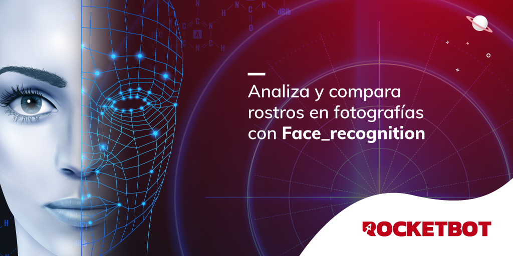

# Reconocedor facial
  
Module para reconocer caras. Puede obtener resultados booleanos o porcentuales. 

*Read this in other languages: [English](Manual_face_recognition.md), [Español](Manual_face_recognition.es.md).*
  

## Como instalar este módulo
  
__Descarga__ e __instala__ el contenido en la carpeta 'modules' en la ruta de Rocketbot.  

## Descripción de los comandos

### Reconocedor de persona
  
Reconocedor de persona
|Parámetros|Descripción|ejemplo|
| --- | --- | --- |
|Ruta de la imagen de referencia|Archivo que servirá de referencia para reconocer a la persona|C:\Users\Robot\Desktop\img.png|
|Ruta de la imagen a reconocer|Archivo que se desea reconocer|C:\Users\Robot\Desktop\img.png|
|Variable donde guardar|Variable donde guardar el resultado|resultado|

### Reconocedor facial en porcentaje
  
Reconocedor facial en porcentaje
|Parámetros|Descripción|ejemplo|
| --- | --- | --- |
|Ruta del archivo a clasificar|Archivo que servirá de referencia para reconocer a la persona|C:\Users\Robot\Desktop\img.png|
|Ruta del archivo a clasificar|Archivo que se desea reconocer.|C:\Users\Robot\Desktop\img.png|
|Variable donde guardar|Variable donde guardar el resultado|resultado|
